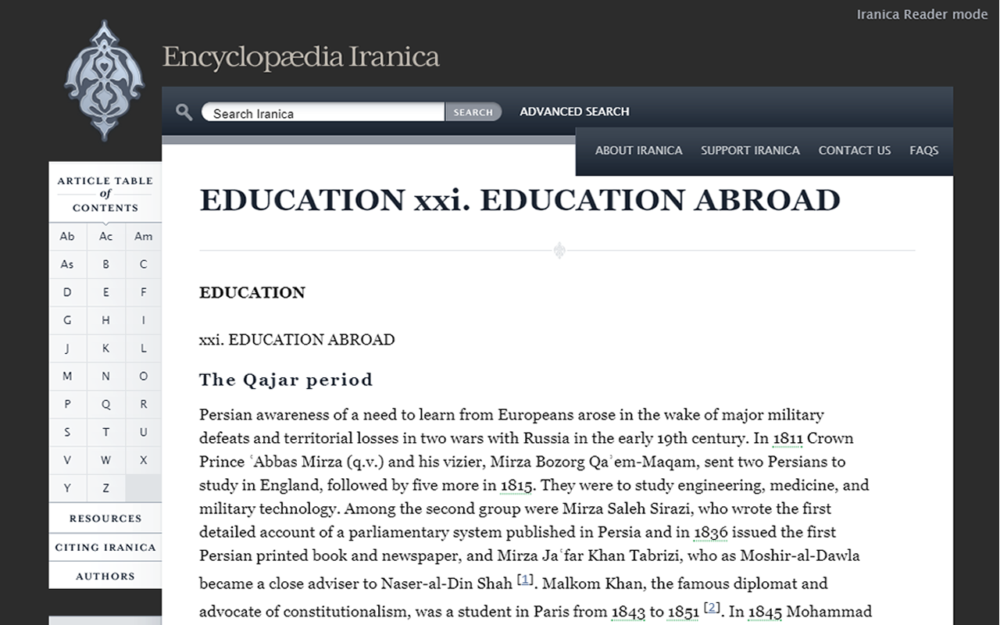

# iranica-reader
Chrome extension for making [Encyclopædia Iranica](http://www.iranicaonline.org/) articles easier to read online.

Install it from [Chrome web store](https://chrome.google.com/webstore/detail/iranica-reader/cicchdojpmpeipimmafllabaedlopopm).

## Screenshots

## List of features

* Removes noisy transliteration diacritics (using [latinize](https://github.com/dundalek/latinize))
* Makes section headers clearly visible
* Moves in-text citation to linked footnote
* Adds collapsible footnotes section at the end
* Collapse date and date ranges to only show Gregorian dates (Islamic dates are shown on mouse hover)
* Splits long paragraphs
* Larger font and wider paragraphs
* Lightbox images using [strip](http://www.stripjs.com/)

### Features in the works
* Options page (maybe?)
* Handle `(q.v.)` refs

## Caveats

Much of the reformatting is done via regular expressions and not all the articles follow a strict format or have correct markup.  

If you notice something odd, temporarily disable the extension, or open the page in incognito mode.

## Change log

- 0.3.0 - Added lightbox image viewer
- 0.1.2 - Initial version

## License

MIT
